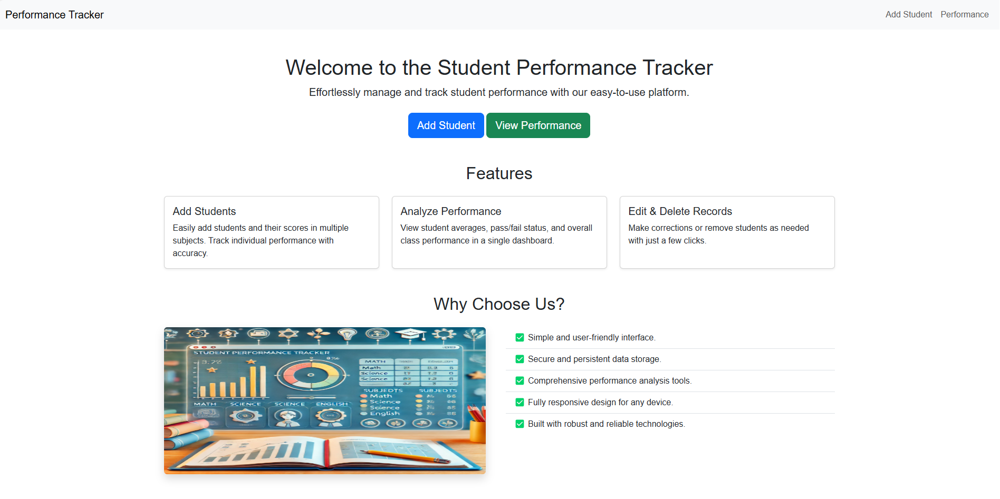
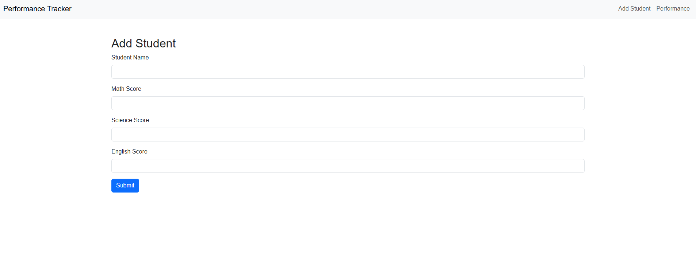
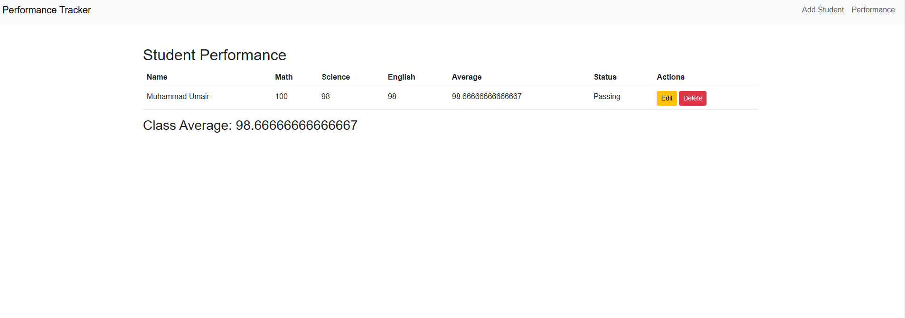
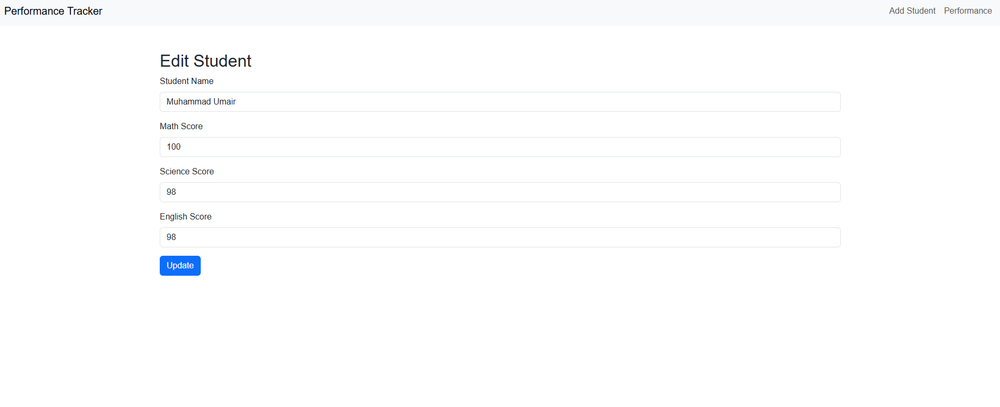

# **Student Performance Tracker**

A **Flask-based web application** designed to track and manage students' performance across multiple subjects. The application allows teachers to add, view, edit, and delete student records, with features to calculate averages and determine pass/fail status. Data is securely stored in a database using **Flask-SQLAlchemy**.

---

## **Features**
- **Add Student Records**: Add a student’s name and their scores in math, science, and English.
- **View Student Performance**:
  - View all students’ scores, average marks, and pass/fail status.
  - See the class average.
- **Edit Student Records**: Modify existing student details or scores.
- **Delete Student Records**: Remove students from the database.
- **Responsive Design**: Fully responsive and styled using **Bootstrap**.
- **Database Integration**: Persistent data storage using **SQLite**.

---

## **Technology Stack**
- **Backend**: Flask, Flask-SQLAlchemy
- **Frontend**: HTML, CSS, Bootstrap, JavaScript
- **Database**: SQLite
- **Development Tools**: Visual Studio Code, Python 3.9+

---

## **Installation**

Follow these steps to set up the project locally:

### **Step 1: Clone the Repository**
```bash
git clone https://github.com/m-umairshah/student_performance_tracker.git
cd student_performance_tracker
```

### **Step 2: Create a Virtual Environment**
```bash
python -m venv venv
```

### **Step 3: Activate the Virtual Environment**
- **Windows**:
  ```bash
  venv\Scripts\activate
  ```
- **macOS/Linux**:
  ```bash
  source venv/bin/activate
  ```

### **Step 4: Install Dependencies**
```bash
pip install -r requirements.txt
```

### **Step 5: Initialize the Database**
```bash
python run.py
```
This will create the `students.db` file in the project directory.

---

## **Usage**

1. Start the Flask development server:
   ```bash
   python run.py
   ```
2. Open your browser and navigate to:
   ```
   http://127.0.0.1:5000/
   ```

---

## **Project Structure**

```plaintext
student_performance_tracker/
├── app/
│   ├── static/
│   │   ├── css/
│   │   │   ├── styles.css
│   │   └── js/
│   │       ├── animations.js
│   ├── templates/
│   │   ├── base.html
│   │   ├── index.html
│   │   ├── add_student.html
│   │   ├── edit_student.html
│   │   ├── performance.html
│   ├── __init__.py
│   ├── models.py
│   ├── routes.py
├── run.py
├── requirements.txt
├── README.md
```

---

## **Screenshots**

### **Home Page**


### **Add Student**


### **Student Performance**


### **Edit Student**


---

## **Future Enhancements**
- Add functionality for exporting performance reports as PDFs.
- Include authentication for teachers to manage student data securely.
- Extend subject categories dynamically.

---

## **Contributing**
Contributions are welcome! Please follow these steps:
1. Fork the repository.
2. Create a new branch (`git checkout -b feature-branch`).
3. Commit your changes (`git commit -m "Add feature"`).
4. Push the branch (`git push origin feature-branch`).
5. Open a pull request.

---

## **License**
This project is licensed under the GNU License. See the [LICENSE](LICENSE) file for details.

---

## **Contact**
For any inquiries or suggestions, feel free to reach out:

**Author**: Muhammad Umair  
**Email**: muhammadumair4302@gmail.com  
**GitHub**: [github.com/m-umairshah](https://github.com/m-umairshah)

---

Let me know if you need further adjustments or enhancements! 😊